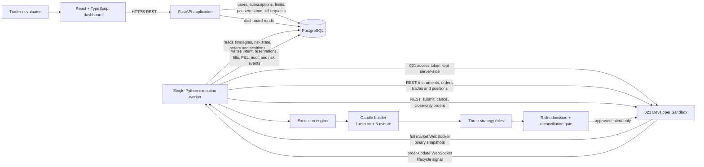

# Architecture Diagram - AlgoRhythm and 021 Sandbox

## Where to use it

Use this on the **Architecture** slide, immediately after introducing the solution. It shows that AlgoRhythm owns strategy decisions, risk controls, accounting, and recovery, while 021 provides the sandbox market and broker interfaces.

## Diagram goal

Emphasise four ideas:

1. The browser never holds the 021 access token or talks directly to 021.
2. The API handles users and dashboard operations; the worker alone submits strategy orders.
3. PostgreSQL is the durable source of local strategy, order, fill, position, risk, and recovery state.
4. Market data, order events, and REST reconciliation form different but complementary feedback paths.

## Mermaid source

## Speaker notes

- “The dashboard is an operations console, not a direct broker client.”
- “The worker is the only component authorised to send strategy orders.”
- “Every submission is persisted with an intent and reserved quantity before the broker API call.”
- “The order socket is treated as a signal to reconcile; broker REST orders/trades/positions remain the source of truth.”

## Design recommendation

Render in a 16:9 slide. Use one colour for **AlgoRhythm** components, one contrasting colour for **021 Sandbox**, and a neutral colour for PostgreSQL. Label the arrows with verbs; avoid showing secrets or a token value.
