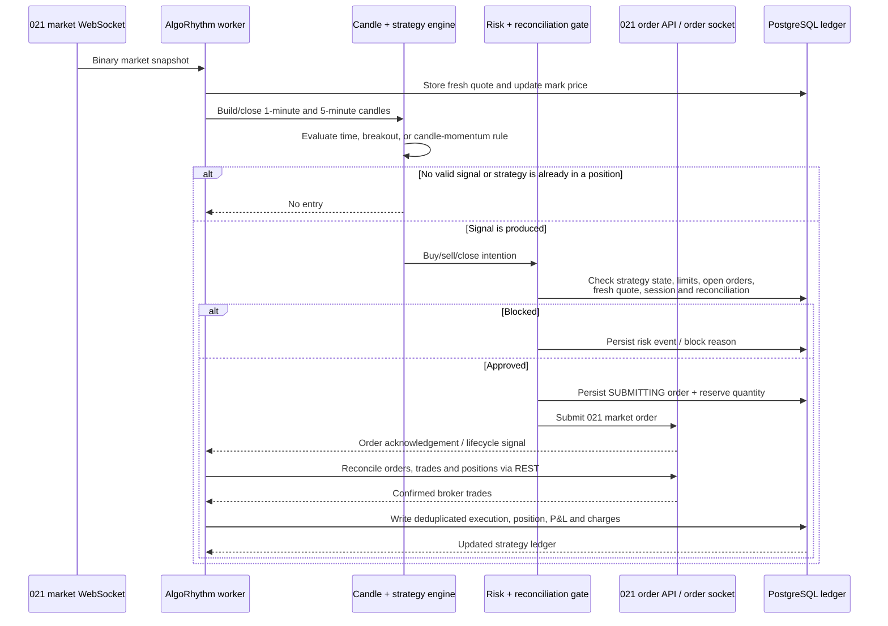

# Execution Lifecycle Diagram - From Market Tick to Confirmed Position

## Where to use it

Use this on the **How the solution works** or **Strategy execution** slide. It makes the difference between a strategy signal and an actual broker order clear.

## Diagram goal

Show that the platform does not blindly trade on every tick. It waits for valid market data, builds closed candles where needed, evaluates a rule, applies risk/reconciliation checks, and uses confirmed broker trades to update P&L and position state.

## Mermaid source

## Speaker notes

- “A signal is only an intention. Risk admission is a separate, mandatory step.”
- “The worker records the order before the remote call so a crash cannot silently lose ownership.”
- “Only confirmed broker trade rows create executions. WebSocket events trigger reconciliation but are not treated as duplicate fill data.”
- “For the recurring candle-momentum strategy, a fresh closed candle is required before another decision can be made.”

## Design recommendation

Use a sequence diagram rather than a flowchart because timing and confirmation matter. Highlight the `SUBMITTING` persistence step and the confirmed-trade step with callouts in the final slide design.
