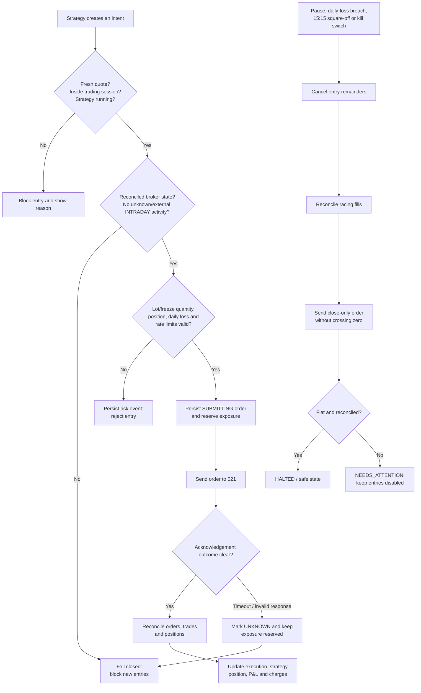

# Risk and Recovery Diagram - Fail Closed, Then Reconcile

## Where to use it

Use this on the **USP / Showstopper** slide. This is the strongest technical differentiation: the product is designed to avoid creating untracked exposure when data or broker responses are uncertain.

## Diagram goal

Show the normal path, blocked-entry path, and emergency path without overloading the architecture slide.

## Mermaid source

## Speaker notes

- “When something is uncertain, AlgoRhythm chooses safety over continued trading.”
- “An API timeout is not treated as a rejection because the broker may still have accepted the order.”
- “The kill switch does not claim success until the local strategy ledgers and broker state are both flat and reconciled.”
- “Close-only orders reduce an existing attributed position; they cannot reverse or accidentally create a new position.”

## Design recommendation

Use this as a simplified high-level diagram. In the final design, colour normal flow green/neutral, blocked paths amber/red, and recovery/kill flow blue. Do not label it ‘guaranteed 10-second kill’; the implementation reports a target and escalates to `NEEDS_ATTENTION` if confirmation is unavailable.
